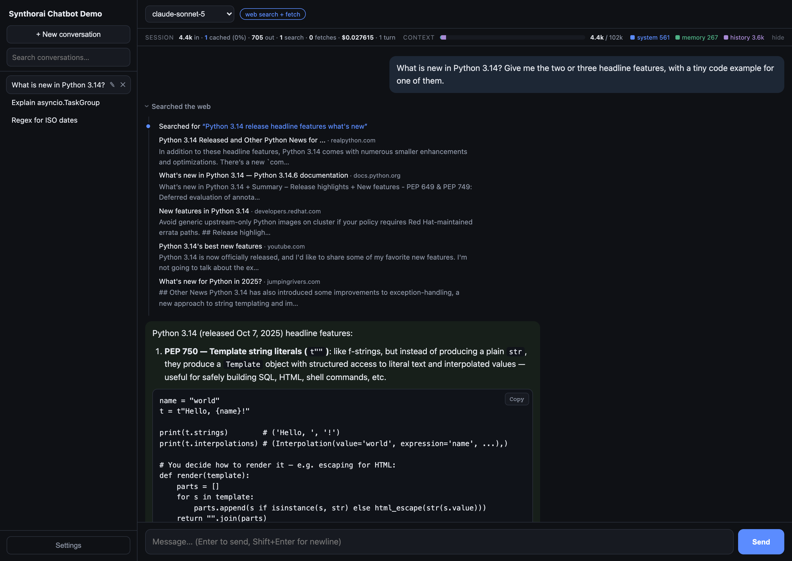

# Synthorai use cases

Runnable companion code for the guides at [synthorai.io/use-cases](https://synthorai.io/use-cases/).
One directory per use case. Every project is small on purpose: a reference you can
read top to bottom, run locally in a couple of minutes, and copy pieces from.

| Directory | Use case | Guide |
|---|---|---|
| [`chatbot/`](./chatbot/) | Synthorai Chatbot Demo: the four systems behind a chat box — model selection, context management with prompt caching, memory with automatic compression, and tool calling (thinking, web search, web fetch) | [Build an LLM chatbot](https://synthorai.io/use-cases/chatbots/) |

All projects talk to the [Synthorai gateway](https://synthorai.io/) through the
plain OpenAI-compatible API, so switching the underlying model is a one-string
change. Any OpenAI-compatible endpoint works if you point `BASE_URL` at it.

Credentials are shared: copy [`.env.example`](./.env.example) to `.env` here at
the repo root and put your key in it once — every use case reads it. A use case
may keep its own `.env` for settings specific to it, which take precedence.

## License

[MIT](./LICENSE)
