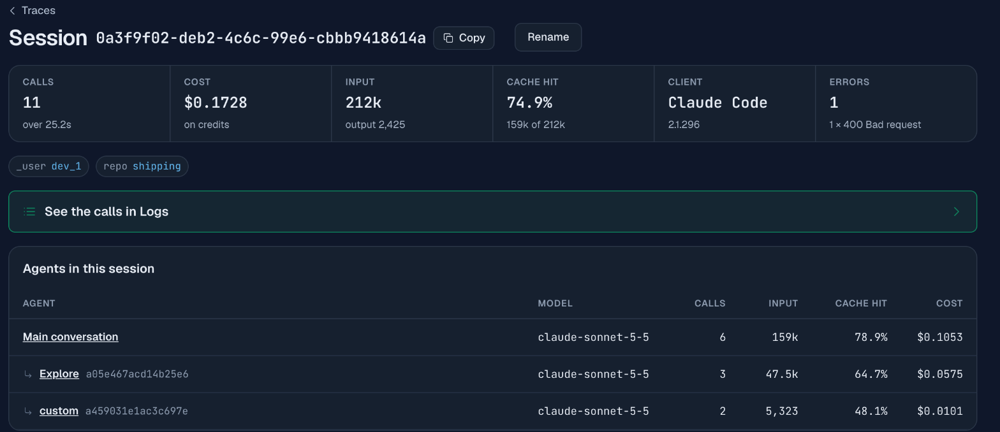
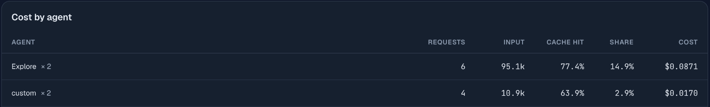

# Coding agent spend demo

Run Claude Code on a small repository through the Synthorai gateway and see
what the run cost, split by the agents that did the work. The script changes
nothing in your own Claude Code setup: the gateway address and key exist only
in the environment of the process it starts.



## Run it

You need Python 3.10 or later, the `claude` command and an API key in `.env`
at the repo root. Claude Code must be 2.1.280 or later: an older one is
refused for Claude Sonnet 5.5 with a 400 that says so. We ran 2.1.296.

```bash
git clone https://github.com/synthorai-io/use-cases
cd use-cases
cp .env.example .env    # put your API key in it
cd coding-agent-spend
python3 -m venv .venv && source .venv/bin/activate
pip install -r requirements.txt
python run.py --hints --label repo=shipping --label _user=dev_1
```

One run takes about half a minute on Claude Sonnet 5.5. On October 10, 2026
it was billed $0.17 with a cold cache, which is what a first run gets, and
$0.08 when it started half a minute after another run. It prints a session id.
Open [Traces](https://synthorai.io/console/traces) in the console and search
for it.

```text
session 0a3f9f02-deb2-4c6c-99e6-cbbb9418614a
  finished in 28 s, 4 turns, $0.1728 by Claude Code's own count
  claude-sonnet-5-5                20 in   158612 cache read   53058 cache write   2425 out  $0.1728

tests in the agent's copy: pass
```

**Check Claude Code's count against the bill once.** Here they agree: the
session page shows $0.1728 for this run, and so does Claude Code. That depends
on the version. Claude Code works out a cost from its own price table, and
2.1.278 priced this model at $5 and $25 per million input and output tokens
where the gateway billed $2 and $10, so it printed about 2.7 times the bill.
The token counts were the same on both sides every time. The session page is
what you were charged.

## What the agent does

`sample-repo/` is a shipping-rate library with five tests, one of which fails:
an order of exactly 50.00 should ship free and does not. The task asks for
three steps, so that the run has more than one agent in it:

1. the built-in **Explore** sub-agent finds where the rule lives;
2. the main agent fixes it (one character, `>` to `>=`);
3. a custom **test-runner** sub-agent, defined on the command line with
   `--agents`, runs the tests.

The agent works on a copy of `sample-repo/` in a temporary directory, with an
empty `CLAUDE_CONFIG_DIR`, so it sees none of your plugins, MCP servers, memory
or settings and leaves no session files in your real configuration. Its
environment holds the one key it needs and none of the others in your `.env`.
The copy is left in place when the run ends, and its path is printed, so you
can look at what the agent changed.

## Two limits on what it can spend

- Claude Code stops a run at `--max-budget-usd`, set from `RUN_BUDGET_USD`
  (default 0.60).
- The script keeps a ledger in `.data/spend.json` and refuses to start a run
  once the runs so far plus one more could pass `SPEND_CEILING_USD`
  (default 2.00). A run that ends without a result is counted at its limit.

Both limits count in Claude Code's dollars, not the gateway's. When Claude
Code's count ran high, as on 2.1.278, a run was stopped at the limit with
about a third of it actually billed. For a limit on the bill itself, put a
spending limit on the API key in the console.

## What we checked, and what the console showed

All of this is from runs on October 10, 2026 with Claude Code 2.1.296.

**The gateway recognises Claude Code with no setup.** Point
`ANTHROPIC_BASE_URL` at `https://synthorai.io` (no `/v1`) and the session page
shows the client as "Claude Code 2.1.296". Claude Code's own session id becomes
the session, so one `claude` run is one session. Claude Code also sends a
trace id, so the session page has a "Traces in this session" table: two traces
for this run, of 6 and 5 calls.

**Each run starts with one request that fails and costs nothing.** The first
request of a run comes back 400 and is not charged, and Claude Code carries on
without it. The session page counts it: 11 calls, 1 error. The other 10 calls
are the work.

**Sub-agents are split out by default.** Without any extra setting, the
"Agents in this session" table lists the main conversation and each sub-agent
with its calls, input, cache hit and cost. The sub-agents are identified by an
id only (`a59b34e81ead5b800`).

**`CLAUDE_CODE_GATEWAY_HINT_HEADERS=1` adds the type and the tools.** With
`--hints`, the same table names each sub-agent by type: `Explore` for the
built-in one and `custom` for ours. The gateway does not keep the name you
gave a custom agent, so `test-runner` shows as `custom`. Opening a call in
Logs then also shows its kind (`subagent:Explore`) and a "Tools before this
call" list with each tool's name and run time (`Read 7 ms`).

| | default | with `--hints` |
|---|---|---|
| session, client and cost | yes | yes |
| sub-agents split out, by id | yes | yes |
| sub-agent type (`Explore`, `custom`) | no | yes |
| call kind and tool names with run times | no | yes |

**Labels work through `ANTHROPIC_CUSTOM_HEADERS`.** `--label repo=shipping
--label _user=dev_1` sets that variable to an `X-Synthorai-Metadata` header for
the child process, and the session page shows both labels. That is how to split
spend by repository or by developer without giving each one a key: the labels
work in the Traces search box (`metadata.repo = shipping`) and in the Cost by
metadata card under Analytics › Breakdown.

**Each agent pays for its own cold start.** In the run above, the Explore
sub-agent made three calls. The first read 0% of its 14,900 input tokens from
cache and cost $0.0391. The next two read 94% each and cost $0.0052 and
$0.0132. A sub-agent starts with its own system prompt, so the first call of
each one writes a cache entry and reads nothing. The main agent's first call
did the same with 30,000 tokens, for $0.0772, and the custom sub-agent's with
2,562 tokens, for $0.0077. Those three calls were 72% of the run's bill.

**A second run within a few minutes costs about half.** A run that started
half a minute later (`64452dfd-038a-410d-b405-dba463ce4f3b`, the same 11
calls) read 93.1% of its input from cache, against 74.9%, and cost $0.0812
instead of $0.1728. Its three first calls read 82%, 81% and 71% from cache and
cost $0.0183, $0.0101 and $0.0034.

**Across sessions, Analytics › Breakdown has a Cost by agent card.** It totals
each agent type over every session in the time range:



`Explore × 2` and `custom × 2` are the two runs above: one total for each
agent type across both sessions. Without `--hints` a run's sub-agents have no
type, and the card groups them in one row named "Sub-agent". An agent that
sets `X-Agent-Id` itself, like `analyst` in the
[agent tracing demo](../agent-tracing/), gets a row under that name.

## What did not work

- **`--bare` removes the sub-agents.** It is the obvious way to isolate a run,
  and it does, for much less money. But the agent then does all
  three steps itself, the session has one agent, and there is nothing to split.
  This demo uses an empty `CLAUDE_CONFIG_DIR` instead.
- **Claude Code sends no span id**, so a call's Span field reads "not sent".
  The session, its traces and its agents are the units to work with.

## Settings

| Variable | Default | |
|---|---|---|
| `SYNTHORAI_API_KEY` | none | Read from `.env` here or at the repo root |
| `ANTHROPIC_GATEWAY_URL` | `https://synthorai.io` | No `/v1`: Claude Code adds `/v1/messages` |
| `CODING_MODEL` | `claude-sonnet-5-5` | The model for the main agent |
| `RUN_BUDGET_USD` | `0.60` | Passed to `--max-budget-usd` |
| `SPEND_CEILING_USD` | `2.00` | The script's own limit across runs |
